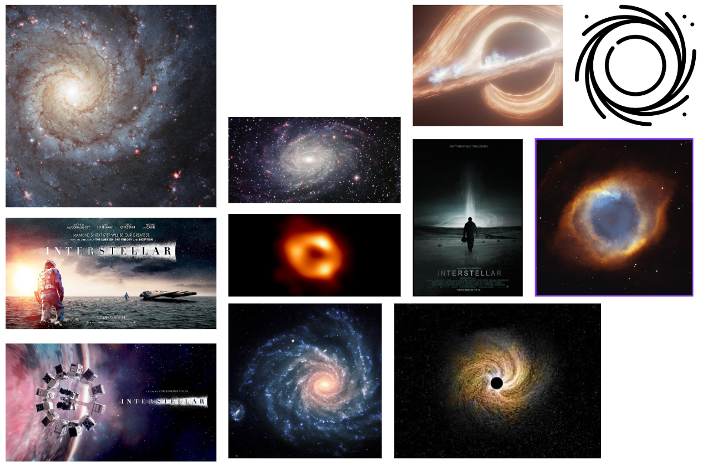

HOSEN Mohsen & MARQUES Thomas

## LANCEMENT DU PROJET
Pour lancer le projet, vous avez deux options :
Accéder à https://MarquesThomasCoding.github.io/creative_galaxy
OU
Lancer le fichier index.html dans un navigateur web

## MOODBOARD

## SUJET
Ce projet génère une galaxie d'étoiles aléatoires, customisable via un formulaire HTML. Il inclut une animation d'explosion de la galaxie et l'affichage d'un trou noir, le tout réalisé avec l'API canvas.

Le site représente une promotion du film (fictif) Interstellar 2, et est inspiré par le film originel.